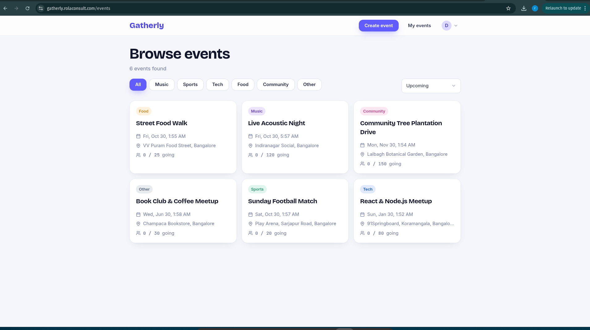
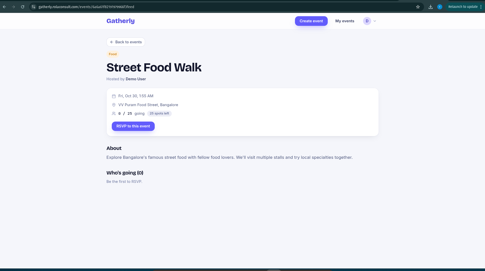
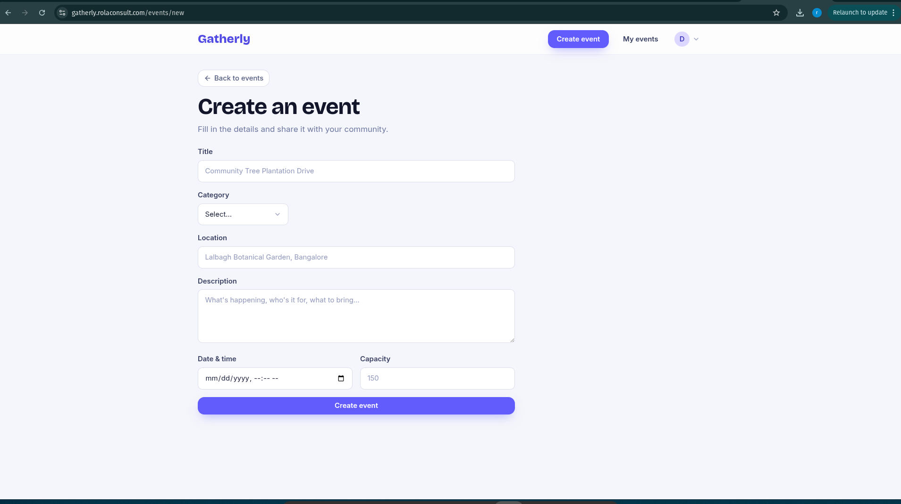
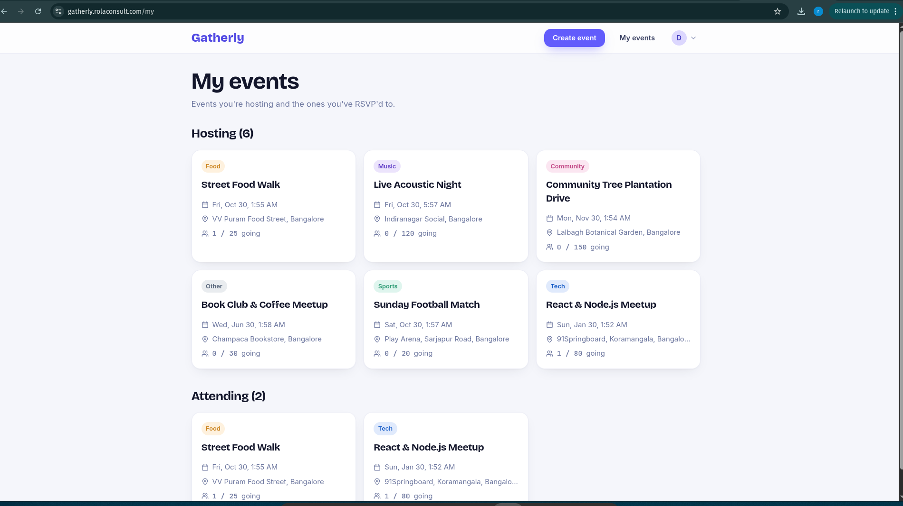

# Gatherly

> A full-stack event platform where users can create local events, browse events nearby, and RSVP with a single click.

Gatherly is a MERN application spanning the MongoDB schema, a REST API, and a responsive React front end. It covers authentication, silent access-token refresh, server- and client-side validation, capacity-limited RSVPs, and filtered/paginated browsing.

**Live demo: [gatherly.rolaconsult.com](https://gatherly.rolaconsult.com)** — deployed on an Ubuntu VPS with Nginx, PM2, and Let's Encrypt SSL.

### Demo account

Use these credentials to sign in and try the app without registering:

```
Email:    demo@gatherly.app
Password: Demo@12345
```

---

## Table of contents

- [Demo account](#demo-account)
- [Screenshots](#screenshots)
- [Features](#features)
- [Tech stack](#tech-stack)
- [Architecture overview](#architecture-overview)
- [How authentication works](#how-authentication-works)
- [API reference](#api-reference)
- [Data models](#data-models)
- [Getting started](#getting-started)
- [Environment variables](#environment-variables)
- [Deployment & setup](#deployment--setup)
- [Project structure](#project-structure)
- [Design decisions](#design-decisions)

---

## Screenshots

| Browse events | Event detail |
|:---:|:---:|
|  |  |

| Create event | My events dashboard |
|:---:|:---:|
|  |  |

---

## Features

**Accounts & authentication**
- Sign up and log in with email + password
- Passwords hashed with bcrypt (never stored in plain text)
- Stateless JWT auth using short-lived **access tokens** and long-lived **refresh tokens**
- Tokens stored in `httpOnly` cookies so JavaScript can't read them (XSS-resistant)
- Access tokens refresh automatically in the background, so a session is not interrupted when an access token expires

**Events**
- Browse all upcoming events in a card grid
- Filter by **category** (music, sports, tech, food, community, other) and by **date** (upcoming / today / this week)
- View a full event detail page with location, date/time, host, and attendee list
- Create events with a validated form
- Edit and delete events — restricted to the creator (ownership is enforced on the server)
- Pagination on the events feed (12 per page)

**RSVP system**
- One-click RSVP toggle (join / leave)
- Live capacity tracking: each event exposes `slotsLeft`, an `isFull` flag, and the current attendee count
- The server **rejects RSVPs to full events** — capacity is enforced in the backend, not just the UI

**"My events" dashboard**
- Lists every event a user has **created** and every event they are **attending**, in one place

---

## Tech stack

| Layer | Technology |
|---|---|
| **Frontend** | React 19, React Router 7, Vite, Tailwind CSS v4, Axios, Zod |
| **Backend** | Node.js, Express 5, Mongoose 9 |
| **Database** | MongoDB |
| **Auth** | JSON Web Tokens (access + refresh), bcryptjs, httpOnly cookies |
| **Validation** | Zod (shared validation logic on client and server) |
| **Icons** | lucide-react |

---

## Architecture overview

The project is split into two independent apps that communicate over a REST API:

```
gatherly/
├── client/   → React SPA (Vite)
└── server/   → Express REST API + MongoDB
```

The **server** uses a layered structure so each piece has a single responsibility:

```
Request
   │
   ▼
Routes ──► Middleware ──► Controllers ──► Models ──► MongoDB
           (protect,       (business
            validate)        logic)
   │
   ▼
Global error handler ──► consistent JSON response
```

- **Routes** map URLs to controllers
- **Middleware** handles cross-cutting concerns: `protect` (auth check), `validate` (Zod schema check), and a global error handler
- **Controllers** contain the business logic
- **Models** define the Mongoose schemas and data rules
- **Utilities** (`AppError`, `sendResponse`, `APIFeatures`) keep the controllers small and consistent

---

## How authentication works

The authentication flow works as follows:

1. **On login/signup**, the server issues two JWTs:
   - an **access token** (expires in 15 minutes)
   - a **refresh token** (expires in 7 days)
2. Both are sent back as `httpOnly` cookies, so they're protected from client-side JavaScript. The refresh token cookie is scoped to the `/api/auth/refresh` path, so it isn't sent with every request.
3. On each protected request, the `protect` middleware reads the access token from the cookie, verifies it, and attaches the user to the request.
4. When the access token expires, the API returns `401`. The Axios interceptor on the client catches that **once**, calls `/auth/refresh` to mint a new access token, and then **retries the original request**.
5. Concurrent 401s are de-duplicated with a single shared refresh promise, so multiple failing requests trigger only **one** refresh call.

The refresh endpoint issues a new access token only; the refresh token itself is not replaced during its 7-day lifetime. Short access-token lifetimes keep the exposure window small while the refresh flow keeps sessions active.

---

## API reference

Base URL: `http://localhost:5000/api`

### Auth

| Method | Endpoint | Description | Protected |
|---|---|---|:---:|
| `POST` | `/auth/signup` | Create an account, receive auth cookies | — |
| `POST` | `/auth/login` | Log in, receive auth cookies | — |
| `POST` | `/auth/refresh` | Issue a new access token from the refresh token | — |
| `POST` | `/auth/logout` | Clear auth cookies | — |
| `GET`  | `/me` | Get the currently logged-in user | ✅ |

### Events

| Method | Endpoint | Description | Protected |
|---|---|---|:---:|
| `GET`    | `/events` | List events (supports filtering, sorting, pagination) | — |
| `POST`   | `/events` | Create a new event | ✅ |
| `GET`    | `/events/:id` | Get one event with host + attendees | — |
| `PATCH`  | `/events/:id` | Update an event (owner only) | ✅ |
| `DELETE` | `/events/:id` | Delete an event (owner only) | ✅ |
| `POST`   | `/events/:id/rsvp` | Toggle RSVP for an event | ✅ |
| `GET`    | `/events/my/dashboard` | Created + attending events for the current user | ✅ |

**Query examples for `GET /events`:**

```
/events?category=tech
/events?dateTime[gte]=2026-01-01T00:00:00.000Z
/events?sort=dateTime&page=2&limit=12
```

Filtering supports the MongoDB-style operators `gte`, `gt`, `lte`, `lt` (e.g. `dateTime[gte]=...`), handled by the reusable `APIFeatures` class.

---

## Data models

### User
| Field | Type | Notes |
|---|---|---|
| `name` | String | required |
| `email` | String | required, unique, lowercased |
| `password` | String | required, min 8 chars, hashed, `select: false` (not returned by default) |

### Event
| Field | Type | Notes |
|---|---|---|
| `creator` | ObjectId → User | required, indexed |
| `title` | String | required, max 200 |
| `description` | String | optional, max 2000 |
| `location` | String | required, max 300 |
| `dateTime` | Date | required, indexed |
| `category` | Enum | music / sports / tech / food / community / other |
| `maxAttendees` | Number | required, min 1 |
| `attendees` | [ObjectId → User] | indexed |

The Event schema exposes computed **virtual** fields — `attendeeCount`, `isFull`, and `slotsLeft` — so the client receives current capacity info without extra queries.

---

## Getting started

### Prerequisites
- Node.js (v18+ recommended)
- A MongoDB database (local or a MongoDB Atlas cluster)

### 1. Clone the repo
```bash
git clone https://github.com/rola-infra/gatherly.git
cd gatherly
```

### 2. Set up the server
```bash
cd server
npm install
cp .env.example .env      # then fill in your values (see below)
npm run dev               # starts on http://localhost:5000
```

### 3. Set up the client
```bash
cd client
npm install
cp .env.example .env      # set VITE_API_URL
npm run dev               # starts on http://localhost:5173
```

Open **http://localhost:5173**.

---

## Environment variables

**`server/.env`**
```env
PORT=5000
MONGO_URI=your-mongo-connection-string
JWT_SECRET=your_access_token_secret
JWT_EXPIRES_IN=15m
JWT_REFRESH_SECRET=your_refresh_token_secret
JWT_REFRESH_EXPIRES_IN=7d
CLIENT_URL=http://localhost:5173
```

`NODE_ENV` is set to `development` by the `npm run dev` script, so it does not need to be added to the development `.env`.

**`client/.env`**
```env
VITE_API_URL=http://localhost:5000/api
```

---

## Deployment & setup

Gatherly is deployed on an Ubuntu VPS and served over HTTPS at [gatherly.rolaconsult.com](https://gatherly.rolaconsult.com). Nginx handles SSL and static files, Express runs under PM2, and MongoDB runs in a Docker container.

### Production architecture

```
Internet
   │
 HTTPS
   │
 Nginx
   ├── Serves the React static build from /var/www/gatherly
   └── Reverse-proxies /api requests to Express on localhost:5000
              │
              ▼
      PM2 Process Manager
              │
              ▼
      Express.js Backend
              │
              ▼
      MongoDB 7 (Docker container)
```

Nginx is the only public entry point. It terminates SSL, serves the compiled front-end directly, and forwards API traffic to the Node process running privately on `localhost:5000`. The database is not exposed to the internet.

### Deployment stack

| Layer | Technology |
|---|---|
| **OS** | Ubuntu Server |
| **Frontend** | React + Vite (static build) |
| **Backend** | Node.js + Express |
| **Database** | MongoDB 7 (Docker container) |
| **Process manager** | PM2 |
| **Reverse proxy** | Nginx |
| **SSL** | Let's Encrypt (Certbot) |
| **Domain** | https://gatherly.rolaconsult.com |

### Frontend deployment

The client is compiled to static assets and served from disk by Nginx.

```bash
cd client
npm install
npm run build
sudo cp -r dist/* /var/www/gatherly
```

Nginx serves everything under `/var/www/gatherly`, so no Node process is involved in delivering the front end.

### Backend deployment

The API runs as a long-lived process under PM2, which keeps it alive across crashes and reboots.

```bash
cd server
npm install

# create and fill in the production environment file
cp .env.example .env

# start the API under PM2
pm2 start src/server.js --name gatherly-api

# persist the process list and enable start-on-boot
pm2 save
pm2 startup
```

Because `NODE_ENV` is read from the `.env` file at startup (via `dotenv`), set `NODE_ENV=production` in the production `.env` so secure cookies and production error handling are enabled.

### Database

MongoDB 7 runs in its own **Docker container** (a single container — no Docker Compose). A named Docker volume is mounted for persistent storage so data survives container restarts and image updates.

```bash
docker run -d \
  --name gatherly-mongo \
  -p 127.0.0.1:27017:27017 \
  -v gatherly-data:/data/db \
  mongo:7
```

The backend connects to it through the `MONGO_URI` value in the environment file. Binding the port to `127.0.0.1` keeps the database reachable only from the server itself.

### Nginx configuration

Nginx handles four responsibilities: serving the React build, supporting client-side routing via `try_files`, proxying the API to Express, and terminating HTTPS with the Let's Encrypt certificate.

```nginx
server {
    server_name gatherly.rolaconsult.com;

    # Serve the React static build
    root /var/www/gatherly;
    index index.html;

    # Support React Router — fall back to index.html
    location / {
        try_files $uri $uri/ /index.html;
    }

    # Reverse-proxy API requests to Express
    location /api {
        proxy_pass http://localhost:5000;
        proxy_http_version 1.1;
        proxy_set_header Host $host;
        proxy_set_header X-Real-IP $remote_addr;
        proxy_set_header X-Forwarded-For $proxy_add_x_forwarded_for;
        proxy_set_header X-Forwarded-Proto $scheme;
    }

    # HTTPS via Let's Encrypt (managed by Certbot)
    listen 443 ssl;
    ssl_certificate     /etc/letsencrypt/live/gatherly.rolaconsult.com/fullchain.pem;
    ssl_certificate_key /etc/letsencrypt/live/gatherly.rolaconsult.com/privkey.pem;
}
```

The SSL certificate is issued and auto-renewed with Certbot:

```bash
sudo certbot --nginx -d gatherly.rolaconsult.com
```

### Production environment variables

**Frontend**

Because Nginx proxies `/api` to Express on the same domain, the client uses a relative API path:

```env
VITE_API_URL=/api
```

**Backend**

```env
PORT=5000
MONGO_URI=mongodb://localhost:27017/gatherly
JWT_SECRET=your_access_token_secret
JWT_EXPIRES_IN=15m
JWT_REFRESH_SECRET=your_refresh_token_secret
JWT_REFRESH_EXPIRES_IN=7d
CLIENT_URL=https://gatherly.rolaconsult.com
NODE_ENV=production
```

---

## Project structure

```
server/
└── src/
    ├── app.js                  # Express app + middleware wiring
    ├── server.js               # Entry point, DB connect + listen
    ├── config/db.js            # MongoDB connection
    ├── controllers/            # Business logic (auth, events)
    ├── middleware/             # protect, validate, error handler
    ├── models/                 # Mongoose schemas (User, Event)
    ├── routes/                 # Route definitions
    ├── validators/             # Zod schemas for requests
    └── utils/                  # AppError, sendResponse, APIFeatures, tokenUtils

client/
└── src/
    ├── App.jsx                 # Routes + route guards
    ├── main.jsx                # React entry point
    ├── context/AuthContext.jsx # Global auth state
    ├── lib/                    # api (axios), formatters, helpers
    ├── pages/                  # Events, EventDetail, CreateEvent, MyEvents, Auth
    ├── components/             # Navbar, EventCard, auth guards, UI primitives
    └── schemas/                # Zod schemas (shared validation shape)
```

---

## Design decisions

Notable implementation choices:

- **Validation lives in one place (Zod), on both ends.** The same validation shape guards the form on the client for instant feedback and the API on the server as the source of truth, so invalid data is rejected even if the UI is bypassed.

- **Consistent error handling.** Every failure flows through a single `AppError` class and a global error handler, which returns detailed errors in development and generic ones in production. Controllers stay small because they `throw` or `next()` an error.

- **A reusable query layer.** The `APIFeatures` class turns URL query strings into filtered, sorted, field-limited, paginated Mongoose queries, so adding filtering to a new endpoint requires minimal code.

- **Security defaults.** Passwords are hashed with bcrypt, tokens are `httpOnly` (unreadable by JS), the refresh cookie is path-scoped to `/api/auth/refresh`, and CORS is restricted to the configured client origin with credentials enabled.

- **Server-side ownership checks.** The UI hides edit/delete controls for events the user doesn't own, and the server independently verifies ownership on every mutation.

- **Session handling.** Short access-token lifetimes limit the exposure window, and the background refresh flow keeps users signed in without a visible session expiry.

---

*Built with the MERN stack, token-based authentication, and a layered backend architecture.*
